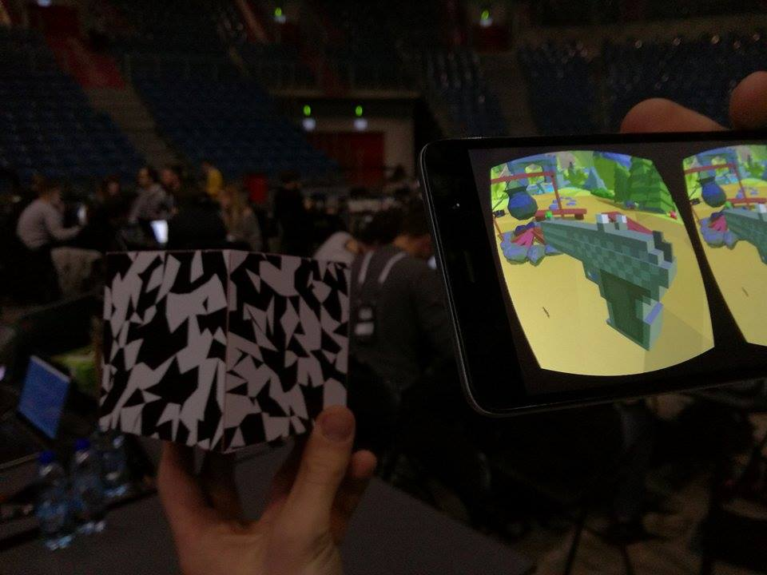
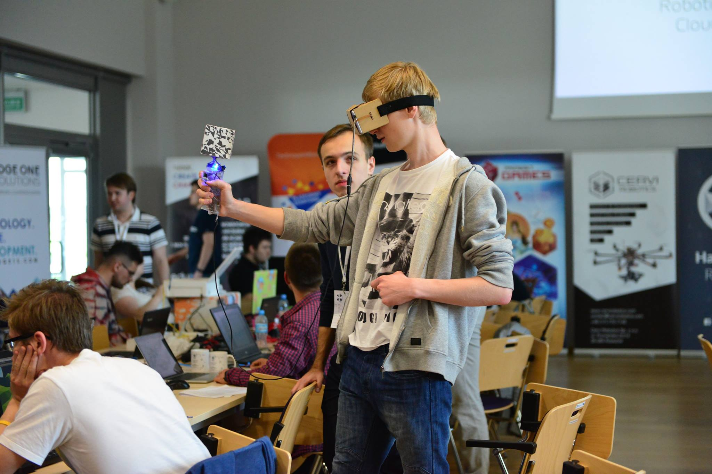

# TowerDefenceVR

SEE GAMEPLAY:

https://youtu.be/dJBQ0O3dObc

First you print a graphics template. After that cut it and then fold it into cube.
Camera of your phone scans the position of cube and you have your own VR controller.
Combine this with Google Cardboard you have your own VR system.

We created a simple game for this system to show its possibilities. 
Watch a gameplay:

